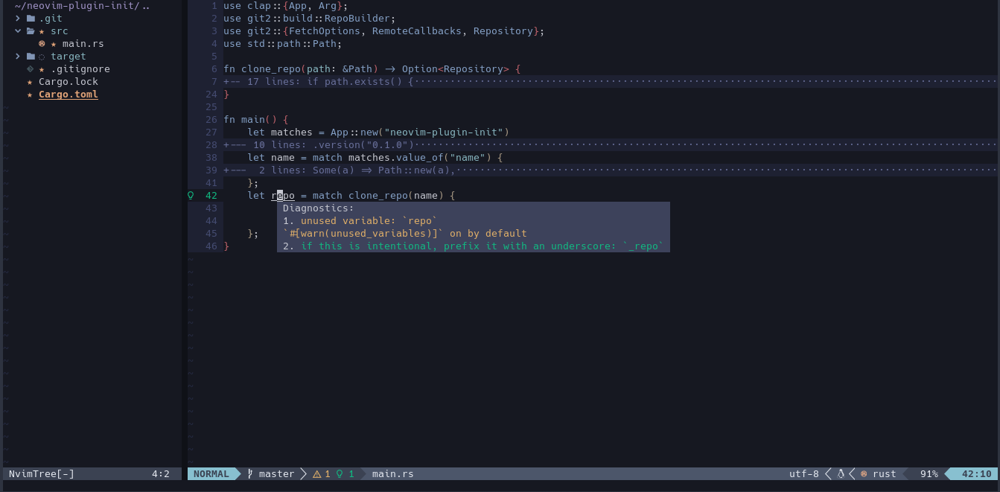
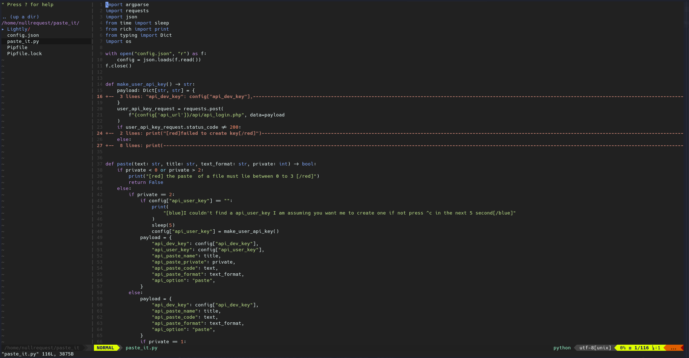
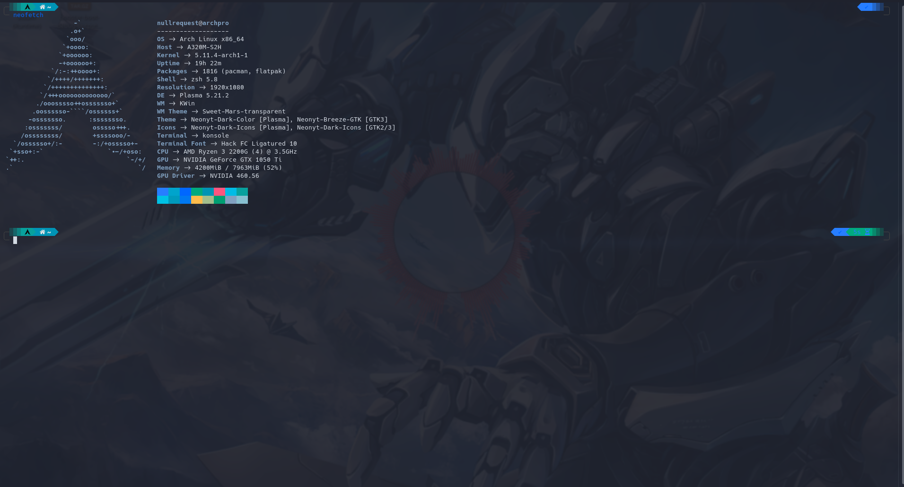

# Nullrequest's dotfiles
This a little repo I made to store my dotfiles. This is can be used alone or with my [auto-init](https://github.com/advaithm/auto_init) script, The auto-init script setups my development environment on Kde Plasma. The script installs my favorite theme, sets my [wallpaper](https://twitter.com/KleinesGluck/status/1336052912594722816) and my uses stow to set up my dotfiles. You will need to following installed to allow you to use all the dotfiles here.
```
vim
neovim
zsh
neofetch
```
You can use only one or two depending on what you like. This repo is intended to be used with [gnu stow](https://www.gnu.org/software/stow/) a nifty program that symlinks these files to the appropriate locations. To create these symlinks all you need to do is
```bash
stow vim neofetch zsh
```
Stow will do the rest and create the symlinks. For neovim you will need to run the following to ensure everything works
```bash
git clone https://github.com/kristijanhusak/vim-packager ~/.vim/pack/packager/opt/vim-packager

```
If you used the auto-init script I created you only need to do the following step. Then finally in vim run `PackagerInstall` and in neovim run `:PackerInstall`, this will install all the required plugins used by vim and neovim. `nvim_old` contains my old neovim config which uses a standard init.vim file. If you prefer vimscript to lua you can use `stow nvim_old` instead of `stow nvim` to install it.

The `nvim` directory contains my rewrite of the config in lua, which offers more control over the config and uses lua instead of vimscript. I have dropped a handful of plugins that didn't really fit into my workflow anymore or didn't work with the lua init file. 

- [Neovim](https://neovim.io/) 

- [vim](https://www.vim.org/)

- [neofetch](https://github.com/dylanaraps/neofetch)+[zsh](https://www.zsh.org/)

